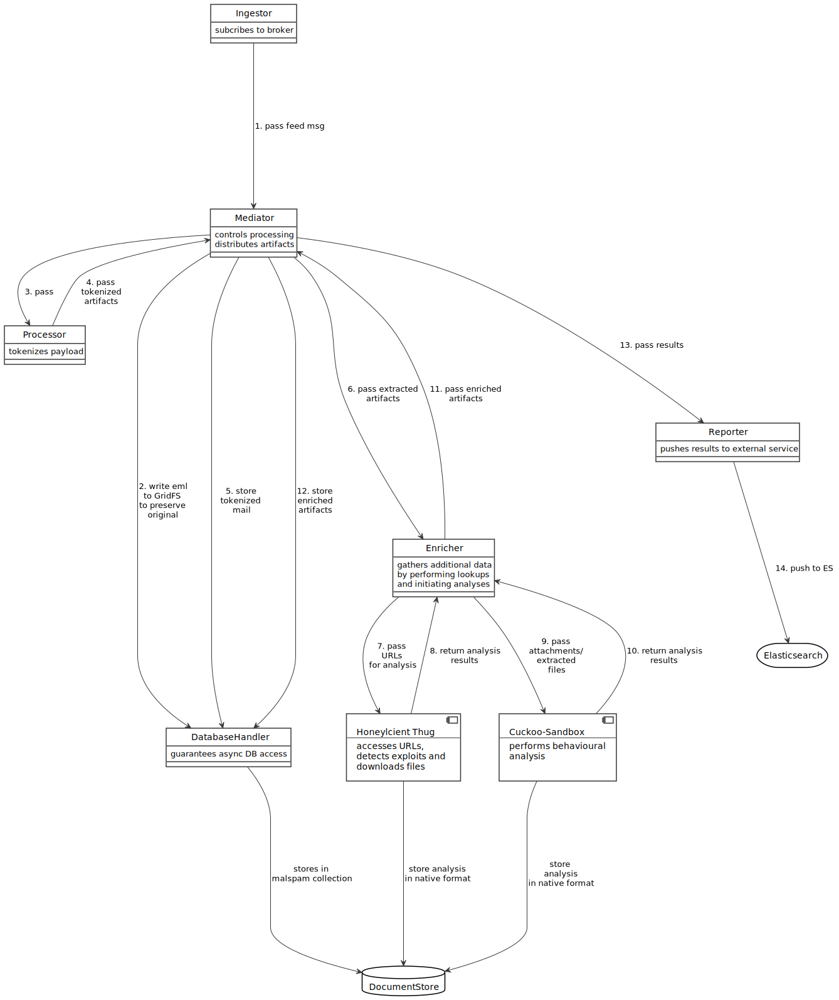

<a id="orgd2f80df"></a>

# spamtrap-system's backend:

This is the source code for the processing backend of the distributed spamtrap-system, which is comprised of collectors - more specifically spamtraps (easily extended to server honeypots like dionaea) -, a [MongoDB](https://www.mongodb.com/) database and a reporting module. The asynchronous processing engine is the core of this system, which relies heavily on [asyncio](https://docs.python.org/3/library/asyncio.html).

The processing backend tokenizes, analyzes and classifies the incoming malspam. It uses the honeyclient [Thug](https://github.com/buffer/thug) for extraction of malware in download links and the malware analysis sandbox [Cuckoo](https://github.com/cuckoosandbox/cuckoo) further processing of the extracted binaries. The observed network connections during the execution of the samples as well as the malware configuration data containing command-and-control addresses found by [MalConfScan](https://github.com/JPCERTCC/MalConfScan) is extracted and used to map malware infrastructure, which will be presented in an [Elastic Stack](https://www.elastic.co/elastic-stack)

## Table of Contents
- [spamtrap-system's backend:](#orgd2f80df)
  - [Motivation](#orgda22744)
  - [Architecture](#org4d49ebb)
    - [Components](#org818473b)
    - [Processing procedure](#org7325c81)
  - [Usage](#org882432c)
  - [Installation](#orgc700d3c)
    - [Backend dependencies](#orgbe1be2c)
  - [Configuration](#orgfb500cb)
    - [Gelocation data](#org5bc9e44)
    - [Hpfeeds broker](#org7e18493)
    - [MongoDB](#org34df5e1)
    - [Cuckoo](#org3558205)
    - [Thug](#org0b12a3d)
    - [Elasticsearch](#orgb5c0cc5)

<a id="orgda22744"></a>

## Motivation

As already stated in [spamtrap-system's readme](../readme.md) **malspam** is one of the biggest cyberthreats. To the best of our knowledge there is no pipeline based on open source tool to analyze malspam samples and retrieve information about the network infrastructure used by the malware

The backend fulfills the tasks of persisting and analyzing collected malspam, while being decoupled from all collectors. It aims to streamline the process of extraction information on the network infrastructure used by the collected malware. For collection refer to the directory [collectors](../collectors/), where the tools, which collect malspam are stored. `maltrap` itself receives those messages by using hpfeeds, persists those messages, processes and analyzes these date to finally report the results to an Elastic Stack and infer actionable threat intelligence.


<a id="org4d49ebb"></a>

## Architecture

The architecture is modular, the objects are passed around between the asynchronously running worker task with the help of queues. There are several components for ingesting the hpfeed, mediating the retrieved objects, processing and tokenization, enrichment and reporting. Those can flexibly extended, e.g. another processor could be added, which handles binary submissions of [Dionaea](https://github.com/DinoTools/dionaea) server honeypots or another reporter could be incorporated to report to MISP instance, too, and not only to an Elasticsearch instance.


<a id="org818473b"></a>

### Components

The processing backend consist of five components, which utilize subcomponents in turn for specialized task.

-   [FeedIngestor](processing_backend/feed/): Subscribes to hpfeeds-broker and receives hpfeeds-messages
-   [Mediator](processing_backend/mediator.py): Mediates data to process, enrich, store and report
-   [Processor](processing_backend/processor/): Tokenizes payloads, for each and every hpfeeds-channel a separate processor can be defined <sup><a id="fnr.1" class="footref" href="#fn.1" role="doc-backlink">1</a></sup>
-   [Enricher](processing_backend/enricher/): Performs enrichment, extracts further artifacts, and actual analysis (e.g. downloading file from URL, initiating detonation of malware in sandbox)
-   [Reporter](processing_backend/reporter/): Passes results to external plattform (e.g. Elasticsearch, MISP in future?)

Central element is the mediator, who is responsible for putting the objects on the right queues. Flexible parent-child-relationships could be built and each and every artifact can be handled and enriched on its own. E.g.: A received mail contains an URL, where an archive is hosted, which contains a malicious executable. The [DatabaseHandler](processing_backend/database/) is responsible for persisting data in the MongoDB, where each entity is stored in a separate collection (emails, files, urls, networkentities). This is accomplished by relying on [Motor](https://github.com/mongodb/motor), which is a non-blocking MongoDB driver for Python with asyncio.


<a id="org7325c81"></a>

### Processing procedure

The following figure shows the building blocks and the single processing steps, which are actually performed asynchronously and happen therefore concurrently. The handing over of the data - the inter-task component communication so to say - is realized by using queues.

<p align="center" color="white"></p>

The ingestor component subcribes to the specified hpfeeds-channel in order to receive spam-messages. If such a message is received, a FeedMsg is constructed and passed to the Mediator. The Mediator is the central player, who controls the processing steps. The received message is at first persisted in its original form with the help of the DatabaseHandler, then it will be tokenized by the Processor-component. The tokenized result is passed to back to the Mediator again, which will put it on the queue for enriching, if needed. The Enricher component then triggers the analysis with Thug and/or Cuckoo. Thug is used by utilizing the Thug's Python API, the interaction with Cuckoo is accomplished by using its REST API <sup><a id="fnr.2" class="footref" href="#fn.2" role="doc-backlink">2</a></sup>. The Enricher receives and processes the results after analysis and passes them to the mediator. If the extracted artifact can be enriched further, it is placed on the enriching queue again, if it is fully enriched and should be reported, the mediator will pass it to the Reporter component by using the respective queue. The Reporter interacts with the enterprise search engine Elasticsearch and ingests the objects by using its REST API.


<a id="org882432c"></a>

## Usage

The backend code offers only one commandline argument named `--config` to pass the path to a YAML-file, in which component and service configuration is bundled. Given the interplay between the backend and its services, as well as the configuration choices, this seems to be the only reasonable choice.

```bash
usage: run_backend.py [-h] [--config CONFIG_FILE]

Processing backend of spamtrap system. This component is able to subscribe to
hpfeeds-channel and receive messages in th eform of JSON files from there.
These messages will be persisted, further processed depending on the name of
the originating channel, enriched with the help of Thug and Cuckoo and
reported to an Elastic stack.

optional arguments:
  -h, --help            show this help message and exit
  --config CONFIG_FILE  A YAML-file, which is used to specify the components
                        to run and services to contact.
```

The template file [./config/backend.yml](config/backend.yml.template) illustrates the mentioned configuration. To get a grasp of the options and services to configure, see the following section Configuration Note, that it is important, that the services are actually avaiable, if the property `enabled` is set to true.


<a id="orgc700d3c"></a>

## Installation


<a id="orgbe1be2c"></a>

### Backend dependencies

To install the basic dependencies in the form of "normal" Python libraries inside a virtualenv follow the b/m steps:

```bash
# Install virtualenv package
sudo pip3 install virtualenv

# Create virtualenv by specifying a specific interpreter
virtualenv -p /usr/bin/python3.8 backend_venv

# Activate newly created venv
source backend_venv/bin/activate

# Install the processing backends requirements
pip3 install -r ./requirements.txt

# Run it
python3.8 run_backend.py -h

# Deactivate venv
deactivate
```

In order to use the sample staging and detonation utility [sflock](https://github.com/hatching/sflock.git) install the following packages

```bash
sudo apt install p7zip-full rar unrar rar unace-nonfree
```

If you want to be able to handle password-protected 7zip-archives, ensure to install the branch

<https://github.com/jgru/sflock/tree/add-7zip-password-handling>,

which was submitted as a [pull request](https://github.com/hatching/sflock/pull/53) also. (Alternatively apply [this patch](https://pastebin.com/SfwnZGrT) to `sflock/abstracts.py` and [this one](https://pastebin.com/FE18rvAu) to `slock/unpack/zip7.py` by using the command: `patch -u slock/unpack/zip7.py -i zip7.py.patch`.

In order to install [Thug](https://github.com/buffer/thug) some additional steps are needed, because it has further dependencies and the required [STPyV8](https://github.com/area1/stpyv8) has no package on Pypi. STPyV8 provides interoperability between Python3 and JavaScript running Google's V8 engine for Thug.

```bash
# Basic build tools
sudo apt-get install python3 python-dev python3-dev build-essential libssl-dev libffi-dev libxml2-dev libxslt1-dev zlib1g-dev

# Libfuzzy header files for ssdeep
sudo apt-get install libfuzzy-dev

# Graphviz header files
sudo  apt install graphviz-dev
sudo apt install libemu
sudo apt install libemu-dev

# Install thug inside venv
source backend_venv/bin/activate
pip3 install thug

# Retrieve and install stpyv8 inside venv
wget https://github.com/area1/stpyv8/releases/download/v8.8.278.6/stpyv8-8.8.278.6-cp38-cp38-linux_x86_64.whl
pip3 install stpyv8-8.8.278.6-cp38-cp38-linux_x86_64.whl
```

Note: Please choose the right version for your CPU architecture, OS and interpreter version from STPyV8's release page (<https://github.com/area1/stpyv8/releases> in order to be able to use the honeyclient thug.


<a id="orgfb500cb"></a>

## Configuration

The following sections deal with the modification of [./config/backend.yml](config/backend.yml.template) and the configuration of the (peripheral) services and configurable parameters of the backend itself. Rename [config/backend.yml.template](config/backend.yml.template) and to `config/backend.yml` and pass it to `run_backed.py` via `--config`, if you do not place it in the default location.


<a id="org5bc9e44"></a>

### Gelocation data

First set to point to your IP-geolocation database. To be able to approximate IP-address to real world locations MaxMind's free geolocation data *GeoLite2* is used <sup><a id="fnr.3" class="footref" href="#fn.3" role="doc-backlink">3</a></sup>.

```yaml
geo_db: ./GeoLite2-City.mmdb  # relative path to run_backend.py
```


<a id="org7e18493"></a>

### Hpfeeds broker

For a list of potential brokers see <https://hpfeeds.org/brokers>. The usage of the C++ implementation [Tentacool](https://github.com/tentacool/tentacool) is recommended <sup><a id="fnr.4" class="footref" href="#fn.4" role="doc-backlink">4</a></sup>.

Specify the credentials (in the hpfeeds lingo: `ident` and `secret`) as well as the IP-address and port of the hpfeeds-broker. If you are using TLS, which is highly recommended (!), make sure to have a valid X.509-certificate <sup><a id="fnr.5" class="footref" href="#fn.5" role="doc-backlink">5</a></sup>. Specify the channel name and double check, that the broker is available.

```yaml
ingesting:
  hpfeed:
    ident: reader
    secret: secret
    host: 127.0.0.1
    port: 10000
    tls: False

    channels:
      - spam.mails
      #- dionaea.capture  # future use?
```

Specify the channel name. At the date of publishing only `spam.mails` is implemented. The processor-class used for messages received in this channel can handle RFC5322 data <sup><a id="fnr.6" class="footref" href="#fn.6" role="doc-backlink">6</a></sup>. Extending the functionaltity for other channel names and data formats is possible by subclassing [baseprocessor.py](processing_backend/processor/baseprocessor.py) and registering the channel name in the member variable `channel` of type tuple <sup><a id="fnr.7" class="footref" href="#fn.7" role="doc-backlink">7</a></sup>.

Lastly double check, that the broker is available. You can do this by using the CLI tool like so:

```bash
hpfeeds subscribe --tls --host feed.domain.tld -p 10000 -i "reader" -s "secret" -c "spam.mails
```


<a id="org34df5e1"></a>

### MongoDB

MongoDB as NoSQL-database is strictly required for using the spamtrap-system's backend and may be also used by Cuckoo and/or Thug. To spin up an instance, just run `docker-compose up` inside the directory [../periphery/mongodb](file:///media/user01/data/Dropbox/study/masterthesis/lab/spamtrap-system/periphery/mongodb/), which creates a MongoDB instance on localhost. If you prefer to run it in a VM or on a remote host, modify the following YAML-block inside [./config/backend.yml](config/backend.yml.template):

```yaml
persistance:
  mongodb:
    host: localhost
    port: 27017
    database_name: malspam
    indexttl: 10

  dumping:
    dump_files: True
    dump_path: ./dump # relative path to run_backend.py
```

In the section `dumping` you can specify, whether the incoming message should be dumped as files on disk in addition, if you have different use cases and just want to have file-artifacts.


<a id="org3558205"></a>

### Cuckoo

To install Cuckoo use the [Ansible](https://www.ansible.com/) role, which was developed to be able to install this malware analysis sandbox in a automated, fast and painless manner. See <https://github.com/jgru/ansible-cuckoo-virtualbox> for further information.

In order to be able to use Cuckoo, you have modify the configuration file. Specify the IP-address of the host running the Cuckoo REST API and the port number, on which it listens. Furtheron one can specify custom whitelists, which IPs and domain names, which are noise and should be therefore ignored.

```yaml
enriching:
  enabled: True
  cuckoo:
    cuckoo_host: 10.0.0.12
    cuckoo_port: 8090
    cuckoo_timeout: 30
    whitelist_ips: ./config/whitelists/ip_whitelist.txt # relative path to run_backend.py
    whitelist_domains: ./config/whitelists/windows_services.txt # relative path to run_backend.py
```

See [Cuckoo's documentation](https://cuckoo.readthedocs.io/en/latest/installation/host/configuration/) on the optional customization of Cuckoo itselft.


<a id="org0b12a3d"></a>

### Thug

Because Thug runs on the same box as the spamtrap-system's backend very little configuration has to be made. Just make sure, that the right Python interpreter (and the correct virtual environment, here `backend_venv` is used, where STPyV8 and the other dependencies of Thug were installed.

```yaml
thug:
  # Modify thug.conf inside
  thug_config_dir: ./config/thug/ # relative path to run_backend.py
  thug_timeout: 25
  thug_interpreter: ./backend_venv/bin/python3.8 # relative path to run_backend.py
  whitelist_urls: ./config/whitelists/url_whitelist.txt # relative path to run_backend.py
```

Inside Thug's config directory is a file [./config/thug/thug.conf](config/thug/thug.conf), where you can specify, if and possibly which MongoDB to use to store the Thug's analysis results. See [Thug's documentation](https://buffer.github.io/thug/doc/logging.html) for more information on the configurable parameters.


<a id="orgb5c0cc5"></a>

### Elasticsearch

The results can be pushed into an instance of the enterprise search engine Elasticsearch. To accomplish this set `enabled` to true and insert the hostname/IP-address and the corresponding port of the running Elasticsearch database. By setting `relevant_documents` one can specify, which artifacts should be jsonified and pushed into the given Elasticsearch instance.

```yaml
reporting:
  enabled: True
  elasticsearch:
    host: 10.0.0.11
    port: 9200
    index: malspam
    relevant_documents: Email,File,Url,NetworkEntity
```

To deploy a dockerized ES use the `docker-compose.yml`-file inside [../periphery/elasticstack/](file:///media/user01/data/Dropbox/study/masterthesis/lab/spamtrap-system/periphery/elasticstack/) and run `docker-compose up` inside this directory.

Note, that [elastic<sub>reporter.py</sub>](processing_backend/reporter/elastic_reporter.py) creates an index, if it is not existent. The index mapping is specified within this file and could be altered there, if necessary.

## Footnotes

<sup><a id="fn.1" class="footnum" href="#fnr.1">1</a></sup> Inspired by JohnnyKV's <https://github.com/johnnykv/mnemosyne>.

<sup><a id="fn.2" class="footnum" href="#fnr.2">2</a></sup> Note, that both "external" analysis tools can store their results the same MongoDB instance.

<sup><a id="fn.3" class="footnum" href="#fnr.3">3</a></sup> See <https://dev.maxmind.com/geoip/geoip2/geolite2/>.

<sup><a id="fn.4" class="footnum" href="#fnr.4">4</a></sup> The Python implementation has a (unnecessary) restriction of 2KB message size (`MAXBUF = 1024**2`, see <https://github.com/hpfeeds/hpfeeds/blob/master/hpfeeds/protocol.py>). *Tentacool* supports message size up to 10 MB (See <https://github.com/tentacool/tentacool/blob/e1be342b9c2339f6301f808380230d12ab66494d/broker_connection.hpp#L21>).

<sup><a id="fn.5" class="footnum" href="#fnr.5">5</a></sup> *Let's encrypt* is recommended <https://letsencrypt.org/getting-started/>.

<sup><a id="fn.6" class="footnum" href="#fnr.6">6</a></sup> See <https://tools.ietf.org/html/rfc5322>

<sup><a id="fn.7" class="footnum" href="#fnr.7">7</a></sup> I.e. handling binary data received from Dionaea server honeypots and transferred by hpfeeds is possible this way.
