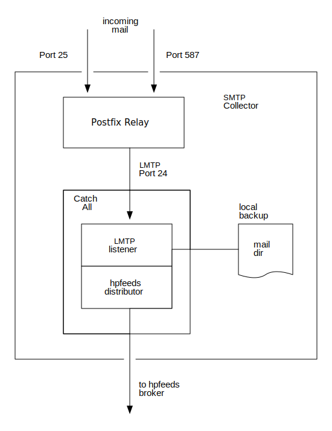

<a id="org27ff6b5"></a>

# smtp-collector

A dockerized setup to build a so-called *Fake Destination SMTP Server*, which collects spam mails directed at any mailbox of a set of domains, which are flexibly to configure. This dockerized component consists of a specific [Postfix](http://www.postfix.org/) configuration, which relays those messages to a Python built catchall [LMTP](https://tools.ietf.org/html/rfc2033) server, that sends the received mails to a message broker via the transport protocol [hpfeeds](https://hpfeeds.org/).


## Table of Contents

- [smtp-collector](#org27ff6b5)
  - [Motivation](#orgc2521d9)
  - [Dependencies](#org5fdbc74)
  - [Using the dockerized setup](#orgc34076a)
  - [Using the catchall LMTP server](#orgebd9ecc)
    - [Installation](#org8cc4994)
    - [Usage](#orgf128db6)


<a id="orgc2521d9"></a>

## Motivation

In the created spamtrap-system the smtp-collector functions as a component to collect spam mails directed at any mailbox of a set of domains. After receiving those messages they will be sent via an intermediary message broker to all subscribers of the channel - namely the processing backend server(s) - in an authenticated and integrity protected manner as a JSON-object formed like this

```JSON
{
  "sha256": "sha256_hexdigest",
  "msg": "rfc5322_data_in_utf8"
}
```

[Postfix](http://www.postfix.org/) is chosen, because it is a battle-tested MTA, which serves as a bastion host in front of the receiving mail server, which was built with the Python library [aiosmtpd](https://github.com/aio-libs/aiosmtpd). [LMTP](https://tools.ietf.org/html/rfc2033) was chosen to keep things simple and leave the queuing up to Postfix.

<p align="center"></p>

The whole deployment of the *Fake Destination SMTP Server* is realized with the help of [Docker](https://docs.docker.com/compose/) and [docker-compose](https://docs.docker.com/compose/). Therefore it is very easy to setup this collector and to start receiving and transferring malspam. By doing so all unnecessary complexity is hidden by abstraction and only the relevant bits of configuration are exposed.


<a id="org5fdbc74"></a>

## Dependencies

smtp-collector requires the following Python packages, which are specified in [requirements.txt](https://github.com/jgru/spamtrap-system/blob/main/collectors/imap-collector/requirements.txt):

-   \`aiosmtpd==1.2.2\`
-   \`atpublic==2.1.1\`
-   \`hpfeeds==3.0.0\`
-   \`mailbox==0.4\`
-   \`PyYAML==5.3.1\`


<a id="orgc34076a"></a>

## Using the dockerized setup

The Postfix server as well as the catchall LMTP server are defined as Dockerfiles for a simple setup. The orchestration of those two containers is done by using `docker-compose`. To get the `smtp-collector` up and running you have to follow three steps:

1.  Prepare server, which should function as fake open smtp destination server

    1.  Setup `iptables` rules to allow SMTP traffic on 25 and mail submission on port 587, but drop outgoing SMTP traffic

        ```
        # Drop outgoing SMTP
        sudo iptables -I OUTPUT -p tcp --sport 25 -m conntrack --ctstate NEW -j DROP
        # Allow outgoing hpfeeds traffic
        sudo iptables -A OUTPUT -p tcp -d ${BROKER_IP} --dport ${BROKER_PORT} -j ACCEPT
        # Allow mail submission
        sudo iptables -I INPUT -i eth0 -p tcp --dport 587 -j ACCEPT
        # Allow receiving SMTP
        sudo iptables -I INPUT -p tcp -i eth0 --dport 25 -j ACCEPT
        ```

    2.  Setup a DNS A-resource record for the server, which will function as fake open smtp destination server
        -   check via `dig A mail.mailserver.tld`
    3.  Cenerate X.509 certificates for hostname of the MTA by using [certbot](https://certbot.eff.org/): Run `certbot certonly` and interactively specify domain names <sup><a id="fnr.1" class="footref" href="#fn.1" role="doc-backlink">1</a></sup>, then copy and rename resulting certificate files :

    ```
    sudo certbot certonly
    sudo cp /etc/letsencrypt/live/.../* ./postfix/assets/
    user=$(whoami)
    sudo chown -R ${user}:${user} certs
    # Rename to cert.pem, privkey.pem, chain.pem, fullchain.pem or change names in Postfix' main.cf
    ```

2.  Setup MX-records for the spamtrap domains to handle on the a/m server
    -   check via `dig MX spamtrapdomain.tld`
3.  Add those spamtrap domains to the Postfix' config file named [relay<sub>domains</sub>](postfix/config/relay_domains).

    ```
    relaydomain1.tld   OK
    relaydomain2.tld   OK
    relaydomain3.tld   OK
    ```

    The domain specified in there will be relayed to the Python-based LMTP server. In the standard setup you don't have to change enything, if you want to relay to a remote machine change the config file named `smtp_transport`<sup><a id="fnr.2" class="footref" href="#fn.2" role="doc-backlink">2</a></sup>
4.  Clone this repo to the fake open smtp destination server
5.  Insert connection details and credentials for the hpfeeds-broker in <catchall-lmtp/data/prod_feed_config.yml>
6.  Run the containers: `docker-compose build && docker-compose up -d`
7.  Check the logs: `docker-compose logs -t -f --tail=10`
8.  Test functionality by using [swaks](http://www.jetmore.org/john/code/swaks/) (a SMTP commandline tool): `swaks -tls -t someone@spamtrap.tld -f someone@example.org --server mailserver.tld:587` (Attention: A lot of ISPs block outgoing SMTP traffic directed to port 25)


<a id="orgebd9ecc"></a>

## Using the catchall LMTP server

If you want to use your own MTA setup and just deploy a LMTP server, which transfers mail to a hpfeeds-broker, follow these instructions:


<a id="org8cc4994"></a>

### Installation

Use Python package installer [pip](https://github.com/pypa/pip) to install the a/m requirements:

```
pip3 install -r catchall-lmtp/requirements.txt
```

Consider installing tho dependencies in a virtualenv like this

```
# Install virtualenv package
sudo pip3 install virtualenv

# Create virtualenv by specifying a specific interpreter
virtualenv -p /usr/bin/python3.7 catchall_lmtp_venv

# Activate newly created venv
source catchall_lmtp_venv/bin/activate

# Install imap-collector's requirements
pip3 install -r catchall-lmtp/requirements.txt

# Run it
python3.8 catchall_lmtp.py -h

# Deactivate venv
deactivate
```


<a id="orgf128db6"></a>

### Usage

You have to specify the port to listen on (`--port`) and to a .yml-file, containing the connection info for the [hpfeeds-broker](https://hpfeeds.org/brokers) and the authentication details. Optionally one can specify a directory, where a local backup of incoming mails is stored in the `maildir`-format <sup><a id="fnr.3" class="footref" href="#fn.3" role="doc-backlink">3</a></sup>. An exemplary call could look like this:

```
python3.8 lmtp_server.py -p 8587 -f /usr/local/etc/feed_config.yml -m /tmp/maildir
```

The full help page looks as follows:

```
usage: catchall_lmtp.py [-h] [-f FEED_CONFIG] [-m MAILDIR] [-p PORT]

Catch all LMTP-server, which run behind a Postfix to forward all emails to a
hpfeeds broker.

optional arguments:
  -h, --help            show this help message and exit
  -f FEED_CONFIG, --feed-config FEED_CONFIG
                        Config file in yaml-syntax specifying broker to use
  -m MAILDIR, --maildir MAILDIR
                        Path to an eventual backup maildir, so that messages
                        do not get lost, if broker or subscribers are not
                        available.
  -p PORT, --port PORT  Port, where the LMTP server is listening on
```

1.  Configuring hpfeeds-submission

    You have to supply a .yml-file, which stores the needed configuration for submitting mails to the [hpfeeds-broker](https://hpfeeds.org/brokers)

    ```yaml
    ---  # Broker config
      broker: "127.0.0.1"
      port: 10_000
      identity: "writer"
      secret: "secret"
      channels:
        - "spam.mails"
    ```

## Footnotes

<sup><a id="fn.1" class="footnum" href="#fnr.1">1</a></sup> See <https://certbot.eff.org/lets-encrypt/debianbuster-other> for details

<sup><a id="fn.2" class="footnum" href="#fnr.2">2</a></sup> See <https://www.linuxbabe.com/mail-server/postfix-transport-map-relay-map-flexible-email-delivery> for more information.

<sup><a id="fn.3" class="footnum" href="#fnr.3">3</a></sup> See <https://docs.python.org/3/library/mailbox.html#mailbox.Maildir>
