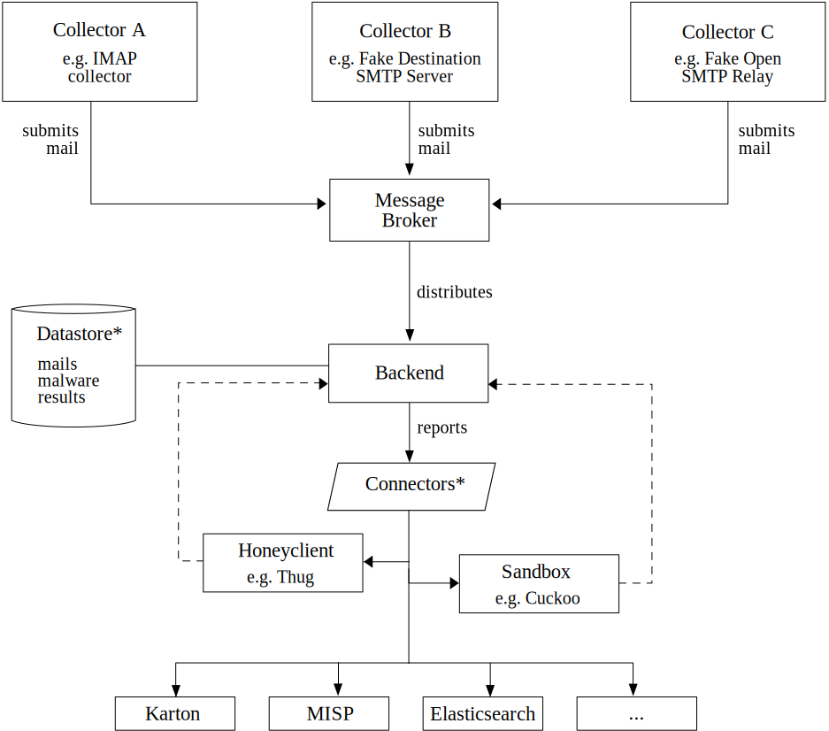

<a id="orgcc0c853"></a>

# spamtrap-system

This repository houses a collection of tools to build and run a distributed spamtrap system that is comprised of IMAP- as well as SMTP-collectors, a fake open SMTP relay and an analysis backend.

The collectors constitute the spamtraps and transfer the collected spam via the publish-subscribe-protocol [Hpfeeds](https://hpfeeds.org/) to the backend. There the (mal)spam will be automatically decomposed and analyzed with the help of [Cuckoo](https://github.com/cuckoosandbox/cuckoo) and [Thug](https://github.com/buffer/thug). The ultimate goal of the system is to gather actionable threat intelligence regarding the infrastructure used by malware, which is accomplished by evaluating the results given by the sandbox and utilizing [MalConfScan](https://github.com/JPCERTCC/MalConfScan). Results are persisted a [MongoDB](https://www.mongodb.com/) instance. In order to assist analyses, relevant results are pushed into an [Elasticsearch](https://www.elastic.co/elasticsearch/) instance with a [Kibana](https://www.elastic.co/kibana) frontend <sup><a id="fnr.1" class="footref" href="#fn.1" role="doc-backlink">1</a></sup>, where threat intel analyst could query the collection.

This project aims to be modular to a large extent, so that further collectors, e.g. server honeypots, or reporting components could be added easily.


## Table of Contents

- [spamtrap-system](#orgcc0c853)
  - [Motivation](#org264d6e6)
  - [Architecture](#orgc4ee69a)
    - [Overview](#orga7a9031)
    - [Results](#orgc901fc2)
    - [Components](#org7b52234)
  - [Usage](#orgce31c2d)
  - [Todo](#org22d5075)
  - [References](#orgb280b10)


<a id="org264d6e6"></a>
                 
## Motivation

At the time (mid 2022) of writing **malspam** is the prevalent method of spreading malware. Malspam is defined as follows:

"Malspam, short for malware spam or malicious spam, is spam email that delivers malware. While regular spam is simply any unsolicited email, malspam contains infected attachments, phishing messages, or malicious URLs. It can also deliver a myriad of malware types [&#x2026;]." <sup><a id="fnr.2" class="footref" href="#fn.2" role="doc-backlink">2</a></sup>

**Malspam** can be considered one of the biggest cyberthreats. In order to be able to acquire and disseminate threat intelligence enabling defenders to mitigate the risks, it is important to collect malspam, form IoCs and map network infrastructure used by malware. The developed spamtrap system helps to streamline the whole process while, it relies on distributed components and the renowned open source tools [Cuckoo](https://github.com/cuckoosandbox/cuckoo) and [Thug](https://github.com/buffer/thug).

To the best of our knowledge, there is no pipeline based on open-source tools, which is able to analyze malspam samples and retrieve information about the network infrastructure (more specifically malware distribution sites and command-and-control servers) from end-to-end in an automated manner.


<a id="orgc4ee69a"></a>

## Architecture


<a id="orga7a9031"></a>

### Overview

The following figure illustrates the high-level architecture of the system and describes how distributed components interact.

<p align="center"></p>

Mail is collected by different collectors which can be deployed in the cloud without much effort. They sent collected messages to a message broker by utilizing the publich-subscribe protocol [Hpfeeds](//hpfeeds.org/wire-protocol). The backend acts as a subscriber of the Hpfeeds channel in question, in which the spam mails are pushed into. Then, it tokenizes received mails, extracts attachments and downloads files from the URLs, which are mentioned inside the mail body, with the help of the honeyclient [Thug](https://github.com/buffer/thug) (its Python API to be more specific). Archives are extracted, even when locked with a password (if it is mentioned in the mail body), and executable files are then submitted into the open source malware analysis sandbox [Cuckoo](https://github.com/cuckoosandbox/cuckoo) by using its REST API.


<a id="orgc901fc2"></a>

### Results

Results, like the identified spam SMTP servers, malware distribution sites and command-and-control servers will be extracted and stored in the document store [MongoDB](https://www.mongodb.com/). The resuls can then be presented visually with the help of [Elasticsearch](https://www.elastic.co/elasticsearch/) and [Kibana](https://www.elastic.co/kibana).

The screenshot below illustrates a Kibana dashboard created by collected malspam and the extracted intelligence. Spam senders, misused MTAs, malware distribution sites as well as C&C-servers are shown and presented as actionable threat intelligence.

<p align="center"></p>


<a id="org7b52234"></a>

### Components

As already mentioned above, the distributed system consists of several components. Their code is stored in the respective subdirectories, where their concept, usage and other details are described in the `readme.org`-files placed in there.

The project is structured as follows:

```
.
├── backend # Contains the processing backend
│   ├── config
│   └── processing_backend
├── collectors  # Collector code
│   ├── fosr-collector # Fake open relay
│   ├── imap-collector # IMAP retrieval
│   └── smtp-collector # Fake SMTP destination server
├── docs
│   └── img
└── periphery # Contains the peripheral components
    ├── elasticstack # Reporting/presentation
    ├── hpfeed-broker-tls # TLS-protected msg broker
    └── mongodb  # Persistence

```


<a id="orgce31c2d"></a>

## Usage

Please refer to the readme-files of the a/m components to find detailed instructions on installation and usage.

The IMAP-collector and the fake open SMTP relay can be used right off the deck after having installed the requirements listed in the respective `requirements.txt`-file. To run the SMTP fake destination SMTP server, the TLS-protected Hpfeeds-broker, the Elastic stack or the MongoDB just use the `docker-compose`-files within [periphery-directory](periphery/).

The installation of Cuckoo is a bit more involved and time consuming. Therefore, an [Ansible](https://www.ansible.com/) role can ease the setup of this malware analysis sandbox. See <https://github.com/jgru/ansible-cuckoo-virtualbox> for further information.


<a id="org22d5075"></a>

## Todo

There are several things that could be added and improved.

- [ ] Add an option to ingest the decomposed malspam into a pipeline of [Karton](https://github.com/CERT-Polska/karton)-tasks
- [ ] Add a reporting module to deliver the results into a [MISP](https://github.com/MISP/MISP)-instance
- [ ] Add Hatching Tria.ge API-usage as an alternative to the on-premise operation of a *Cuckoo*-sandbox
- [ ] Add lookups for threat intel services, like Shodan, URLhaus, GreyNoise v2, VT, etc.
- [ ] Perform performance tests
- [ ] Your idea&#x2026;;)


<a id="orgb280b10"></a>

## References

## Footnotes

<sup><a id="fn.1" class="footnum" href="#fnr.1">1</a></sup> Using version 7.10, which is licensed under Apache 2.0.

<sup><a id="fn.2" class="footnum" href="#fnr.2">2</a></sup> See <https://blog.malwarebytes.com/glossary/malspam/>, accessed 12/07/2022.
